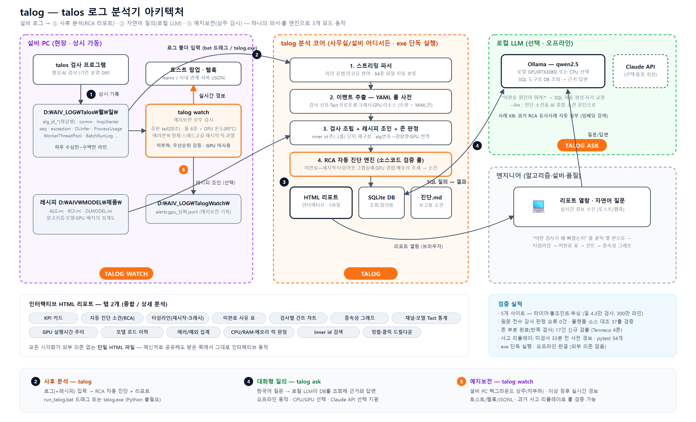

# talog

**talos 설비 로그 진단 분석기** — 로그를 넣으면 "어떤 검사가 왜 빠졌는지"를
자동으로 찾아 리포트로 보여줍니다.


[](https://github.com/CVKim/talog/actions)



## 3가지 모드

| 모드 | 명령 | 하는 일 |
|---|---|---|
| **사후 분석** | `talog <로그폴더>` | RCA 자동 진단 + 인터랙티브 HTML 리포트 + SQLite |
| **대화형 질의** | `talog ask <out폴더>` | 한국어 질문 → 로컬 LLM이 DB를 조회해 근거와 답변 |
| **예지보전** | `talog watch` | 설비 PC 상주 감시 → 이상 징후 실시간 경보 |

## Quick Start

```bash
# 리포트 생성 (레시피는 선택, --open 자동 열기)
talog.exe "D:\AIV_LOG\Talos" --recipe "D:\AIV\MODEL\제품" --open

# 자연어 질의 (Ollama 로컬 LLM, 오프라인)
talog.exe ask .\talog_out --q "어제 미완료 검사 원인은?"

# 예지보전 상주 감시 (watch.yaml 설정)
talog.exe watch
```

현장에서는 `run_talog.bat` 에 로그 폴더를 **드래그&드롭**하면 끝납니다.
개발 환경은 `pip install -e .` 후 `talog` 명령을 사용합니다.

## 핵심 특징

- **RCA 자동 진단** — 미완료↔재시작 상관, 스레드 고갈, 타임아웃·그랩 실패,
  GPU 경합, 메모리 릭 추세를 룰 엔진이 소견 문장으로 서술 (LLM 불필요)
- **소스 코드 검증 룰** — talos-platform/vision 소스와 대조 검증된 이벤트 룰
  (거부 유형 4종, 판정 미송신 확정 증거 등). 포맷이 바뀌면
  `talog/rules/events.yaml` 만 수정
- **존(그룹) 단위 완료 판정** — 다존 설비에서 "일부 존만 검사된 반쪽 완료" 검출
- **단일 HTML 리포트** — 타임라인·간트·종속성 그래프·Tact 통계를 파일 하나로,
  메신저 공유 후에도 인터랙티브 동작
- **레시피 조인** — alg 번호를 결함명·모델·GPU 배치로 번역
- **로컬 LLM + 사례 KB** — Ollama(CPU/GPU 선택)/Claude API 질의, 과거 RCA
  유사 사례 자동 첨부 (`talog kb`)
- **저부하 상주 감시** — 증분 tail + 우선순위 강등 + GPU 미사용. GPU 온도
  감시(nvidia-smi) 포함. `talog watch --check` 로 설치 자가 점검

## 검증

5개 사이트(타이어·볼조인트·부싱) 실로그 9만+ 검사 — 원문 전수 감사 판정 오류
0건, 플랫폼 소스 대조 37룰 검증, 존 부분 완료 17건 신규 검출, 사고 리플레이에서
미검사 33분 전 사전 경보 재현, pytest 54개.

## 문서

- [USAGE.md](USAGE.md) — 상세 사용법·리포트 읽는 법·상태 의미
- [docs/INTERNALS.md](docs/INTERNALS.md) — 파싱 명세·구조·유지보수
- [CHANGELOG.md](CHANGELOG.md) — 변경 이력
